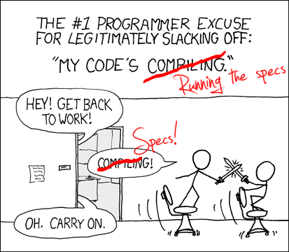
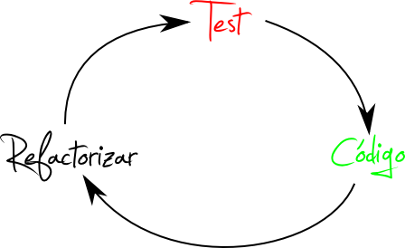

!SLIDE
#RSPEC

Original: [http://xkcd.com/303/](http://xkcd.com/303/)

!SLIDE 

@@@ ruby
    class TestSimpleNumber < Test::Unit::TestCase
     
     def setup
       @num = SimpleNumber.new(2)
     end

      def test_add
        assert_equal(4, @num.add(2) )
      end
     
      def test_multiply
        assert_equal(6, @num.multiply(3) )
      end

    end
@@@

!SLIDE 

@@@ ruby
    describe SimpleNumber do
      
      before :each do
        @num = SimpleNumber.new(2)
      end
     
      it "should add numbers" do
        @num.add(2).should eql 4
      end
      
      it "should multiply numbers" do
        @num.multiply(3).should eql 6
      end
     
    end
@@@

!SLIDE

@@@ ruby
    my_list.should have(3).items
    lambda {my_list << 3}.should change(my_list, :lenght).by(1)
    lambda {my_list.not_defined_method}.should raise_error
    my_list.should_not be_empty #empty?
    parent.should have_children #has_children?
@@@

!SLIDE

@@@ ruby
    class NameList
      def add(name)
        HTTParty.post("http://mylist.com", :name => name)
      end
    end
@@@

!SLIDE

@@@ ruby
    it "should send the name to the service" do
      HTTParty.stub(:post).with(anything).and_return("OK")
      NameList.new.post("toño").should eql "OK"
    end
@@@

!SLIDE

@@@ ruby
    it "should send the name to the service" do
      HTTParty.should_receive(:post)
        .with("http://mylist.com", :name => "toño")
      NameList.new.post("toño")
    end
@@@

!SLIDE

@@@ ruby
    #pseudocódigo
    t = Transaction.new
    t.start { run_test }
    t.rollback
@@@
!SLIDE

!SLIDE
#Gracias

[@dg\_suarez](http://twitter.com/dg_suarez)

[http://github.com/dgsuarez](http://github.com/dgsuarez/)
